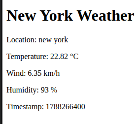

# Azure Weather Data Collector

# Version 1.0.0

A simple Python/Flask application that retrieves weather data from the Xweather API and displays it as a basic web page.

## What it does

* Retrieves NYC weather data from Xweather.
* Extracts location, temperature, wind, humidity, and timestamp.
* Displays the data using a simple Flask HTML template.
* Stores API credentials in `.env` instead of the source code.

## Run

```bash
python -m venv .venv
source .venv/bin/activate
pip install -r requirements.txt
python application/main.py
```

Open `http://127.0.0.1:5000` in a browser.

API credentials should be configured in `.env`. The `.env` file is excluded from Git.

## Preview


